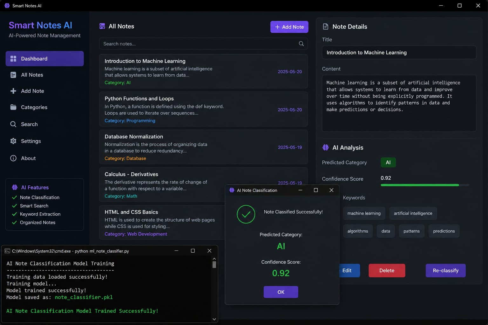

# 🧠 Smart Notes AI


An AI-inspired smart notes organizer built using Python.  
This project helps users create, organize, classify, and manage notes efficiently using rule-based AI concepts and smart categorization techniques.

---

# 🚀 Features

- 📝 Create and manage smart notes
- 🤖 AI-inspired note classification
- 📂 Automatic category organization
- 🔍 Search and filter notes
- 📊 Lightweight and beginner-friendly system
- ⚡ Fast and simple Python workflow
- 🧠 Foundation for future ML integration

---

# 🛠 Tech Stack

- Python
- File Handling
- JSON Storage
- Rule-Based AI Logic
- Machine Learning Ready Structure

---

# 📁 Project Structure

```bash
smart-notes-ai/
│
├── notes/
├── screenshots/
├── ai_note_classifier.py
├── main.py
├── requirements.txt
├── LICENSE
└── README.md
```

---

# ⚙️ How to Run

## 1️⃣ Clone Repository

```bash
git clone https://github.com/Anujgorde2007-lab/smart-notes-ai.git
```

---

## 2️⃣ Open Project

```bash
cd smart-notes-ai
```

---

## 3️⃣ Install Requirements

```bash
pip install -r requirements.txt
```

---

## 4️⃣ Run Project

```bash
python main.py
```

---

# 🧠 AI Model

```bash
python ai_note_classifier.py
```

---

# 📸 Screenshots

## 🖥 Smart Notes AI Dashboard



---

## ✨ Features Preview

- AI-inspired smart note organization
- Clean and beginner-friendly interface
- Category-based note management
- Rule-based AI note classification
- Lightweight and fast Python project
- Ready for future machine learning upgrades

---

# 🎯 Why This Project Matters

This project demonstrates:
- AI-inspired software development
- Practical Python programming
- Smart automation workflow
- Problem-solving using structured logic
- Beginner-to-intermediate AI concepts

It is designed as a strong portfolio project for:
- AI internships
- Open-source contributions
- Academic applications
- MEXT scholarship portfolio
- Software engineering showcase

---

# 🔮 Future Improvements

- Deep learning-based summarization
- Semantic search system
- OCR note scanning
- Voice note support
- Cloud synchronization
- AI recommendation engine
- Mobile application integration

---

# 👨‍💻 Author

## Anuj Gorde

AI & Python Developer  
Passionate about Artificial Intelligence, Automation, and Smart Systems

GitHub:  
https://github.com/Anujgorde2007-lab

---

# 📜 License

This project is licensed under the MIT License.

---
